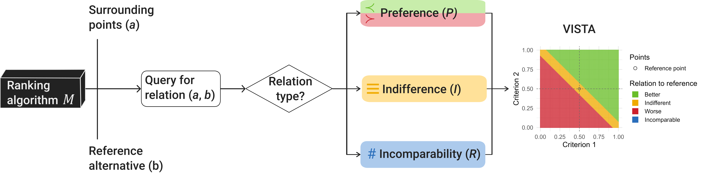
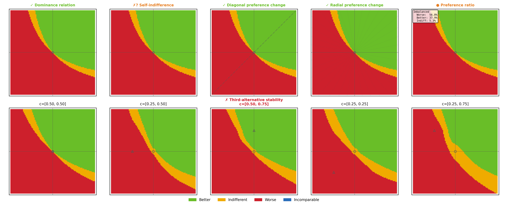
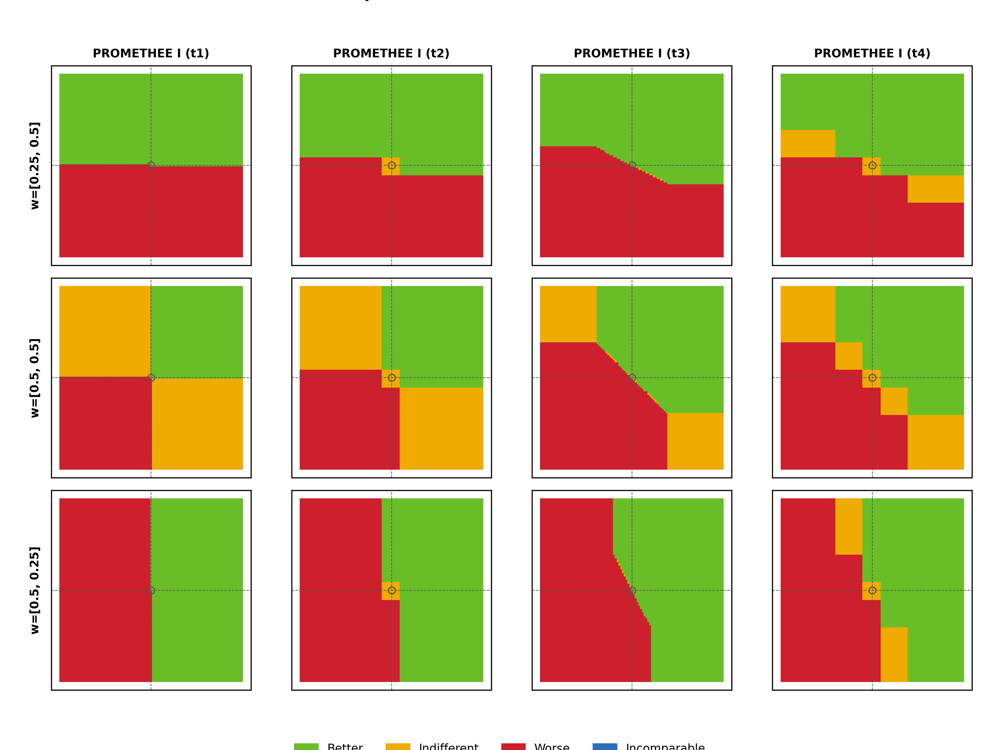
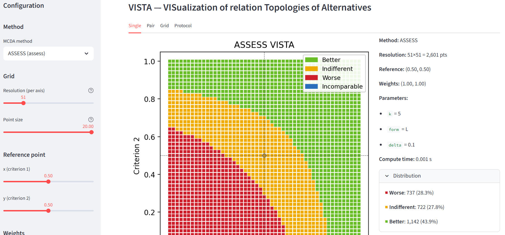

# VISTA — VISualization of relation Topologies of Alternatives

[](https://github.com/dabrze/mcda-vista/actions/workflows/ci.yml)
[](https://www.python.org/)
[](LICENSE)

## Overview



**VISTA** is a visualization framework for Multi-Criteria Decision
Analysis (MCDA) ranking methods. For a given ranking method it sweeps a *test*
alternative across a 2-D criteria space and classifies every point by
its pairwise relation to a fixed *reference* alternative:

| Symbol | Relation         | Meaning                                              |
| ------ | ---------------- | ---------------------------------------------------- |
| P+     | **Better**       | The test alternative is preferred over the reference |
| I      | **Indifferent**  | The method cannot distinguish the two alternatives   |
| P−     | **Worse**        | The reference alternative is preferred               |
| R      | **Incomparable** | The method cannot order the two alternatives         |

The resulting colour-coded map reveals decision boundaries and structural differences between MCDA ranking methods at a glance.

---

## Installation

Install directly from PyPI:

```bash
pip install mcda-vista
```

To include the interactive Streamlit dashboard:

```bash
pip install mcda-vista[app]
```

For development (linting, type-checking, tests):

```bash
git clone https://github.com/dabrze/mcda-vista.git
cd mcda-vista
pip install -e ".[dev]"
```

---

## Quick Start

```python
from mcda_vista import generate_vista, plot_vista

result = generate_vista("topsis", resolution=101, delta=0.10, progress=True)
fig = plot_vista(result, point_size=7)
fig.savefig("topsis_vista.png", dpi=300)
```

<a target="_blank" rel="noopener noreferrer" href="/docs/topsis_vista.png">
    
</a>

`generate_vista` sweeps a 101 × 101 grid of alternatives over the criterion space, evaluates
the ranking method (in this case TOPSIS) at every point, and returns a `VistaResult` dataclass. `plot_vista`
renders it as a scatter plot coloured by the relation type - adjust the `point_size` parameter to the
resolution and size of the image.

You will find practical examples of how to use vistas in the [notebooks](notebooks) folders. A portion of that functionality is highlighted below.

---


## Available Ranking Methods

The package works with pyDecision's built-in methods and any custom method that follows the expected interface. The following methods are registered by default:

| Key             | Display Name  | Key Parameters                                                 |
| --------------- | ------------- | -------------------------------------------------------------- |
| `saw`           | SAW           | `delta` — indifference threshold (default 0.1)                 |
| `topsis`        | TOPSIS        | `delta` — indifference threshold (default 0.1)                 |
| `vikor`         | VIKOR         | `v` — strategy coefficient (default 0.5)                       |
| `macbeth`       | MACBETH       | `delta` — indifference threshold (default 0.1)                 |
| `borda`         | Borda         | *(parameter-free)*                                             |
| `oreste`        | ORESTE        | `alpha` — alpha threshold (default 0.4)                        |
| `spotis`        | SPOTIS        | `delta` — indifference threshold (default 0.1)                 |
| `etopsis`       | E-TOPSIS      | `aggregation` (A/I/R), `epsilon`, `delta`                      |
| `uta`           | UTA           | `k` — breakpoints, `form` (L/X/V/S), `delta`                   |
| `assess`        | ASSESS        | `k` — breakpoints, `form` (L/X/V/S), `delta`                   |
| `electre_iii`   | ELECTRE III   | `q`, `p`, `v` — thresholds; `alpha`, `beta` — cut-level        |
| `electre_iiic`  | ELECTRE IIIc  | `q`, `p`, `v` — thresholds; `lamb` — credibility cutting level |
| `promethee_i`   | PROMETHEE I   | `f` (t1–t7) — preference function; `q`, `p`, `s`               |
| `promethee_ii`  | PROMETHEE II  | `f` (t1–t7), `q`, `p`, `s`, `delta`                            |
| `promethee_iii` | PROMETHEE III | `f` (t1–t7), `q`, `p`, `s`, `lmbd` — interval width            |
| `regime`        | REGIME        | *(parameter-free)*                                             |

List registered methods programmatically:

```python
from mcda_vista.methods import list_methods
print(list_methods())
```

If a pyDecision method is not available by default, you can add it by creating an adapter with `register_method()` or use a custom callable (see below).

---

## Custom Methods

You can pass any callable that accepts a dataset, weights, and keyword parameters and returns a `Relation`:

```python
from mcda_vista import generate_vista, plot_vista, Relation
import numpy as np

def my_method(dataset, weights, **params):
    # dataset[0] = reference, dataset[1] = test point
    score_ref = np.dot(dataset[0], weights)
    score_test = np.dot(dataset[1], weights)
    delta = params.get("delta", 0.05)
    if abs(score_ref - score_test) < delta:
        return Relation.INDIFFERENT
    return Relation.BETTER if score_test > score_ref else Relation.WORSE

result = generate_vista(my_method, resolution=101, delta=0.05)
fig = plot_vista(result)
fig.savefig("custom_method.png", dpi=300)
```

---

## Exploratory Diagnostic Protocol

The VISTA exploratory protocol is a systematic six-step checklist that assesses whether a ranking method meets the decision maker's expectations:

1. **Dominance relation** — no violations in dominating/dominated cones
2. **Self-indifference** — identical alternatives are indifferent
3. **Diagonal preference change** — at most one transition along the diagonal
4. **Radial preference change** — at most one transition along any ray
5. **Preference ratio** — shows whether the Better/Worse ratio is balanced or not
6. **Third alternative stability (IIA check)** — verifies whether the VISTA remains stable when a third alternative is added

```python
from mcda_vista.protocol import run_protocol, plot_protocol_report

report = run_protocol("topsis", resolution=101, delta=0.10)
fig = plot_protocol_report(report, point_size=3)
fig.savefig("protocol_report.png", dpi=300)
print(report.summary())
```


```
VISTA Protocol Report: topsis
=============================
  ✓ PASS  Dominance relation: No violations (2500 dominating, 2500 dominated points).
  ✗? FAIL  Self-indifference: Reference point is Error — likely a numerical issue (nearest grid point at distance 0.0000).
  ✓ PASS  Diagonal preference change: Upper-right: 1 transition(s), lower-left: 1 transition(s).
  ✓ PASS  Radial preference change: All 36 rays have at most 1 transition.
  ● IMBALANCED  Preference ratio: Imbalanced (56.8% worse, 37.9% better than reference).
  ✗ FAIL  Third alternative stability: Max change 14.4% > 5%. Changes: [0.5, 0.5]: 4.5%, [0.25, 0.5]: 10.3%, [0.5, 0.75]: 4.5%, [0.25, 0.25]: 7.4%, [0.25, 0.75]: 14.4%.
```

The protocol uses equal weights and the midpoint as reference by default.
Optionally pass `extra_weights` to test weight sensitivity (e.g., `extra_weights=[[0.25, 0.75], [0.25, 0.50], [0.50, 0.50], [0.50, 0.25], [0.75, 0.25]]`).
See [`notebooks/12_protocol_check.ipynb`](notebooks/12_protocol_check.ipynb) for a full walkthrough with Fuzzy TOPSIS.

---

## VISTA Grid

Use `plot_vista_grid` to compare multiple methods in a single faceted figure.
The example below contrasts different PROMETHEE I function types side by side:

```python
from mcda_vista import generate_vista
from mcda_vista.plotting import plot_vista_grid

weights = [[0.25, 0.50], [0.50, 0.50], [0.50, 0.25]]
promethee_types = ["t1", "t2", "t3", "t4"]

results = [
  [
    generate_vista("promethee_i", resolution=101, weights=w, f=ptype, q=0.05, p=0.20)
    for ptype in promethee_types
  ]
  for w in weights
]

fig = plot_vista_grid(
  results,
  row_labels=[f"w={w}" for w in weights],
  col_labels=["PROMETHEE I (t1)", "PROMETHEE I (t2)", "PROMETHEE I (t3)","PROMETHEE I (t4)"],
  title="Comparison of PROMETHEE I versions",
  point_size=1.5,
)
fig.savefig("vista_grid_promethee.png", dpi=300)
```


---

## Experiments

Reproducible experiments are configured via YAML files stored in
`experiments/configs/`. Each config specifies the method, parameter
ranges, resolution, and output paths. To run an experiment:

```bash
python experiments/run_experiments.py experiments/configs/my_config.yaml --plot
```

Results (CSV grids + metadata JSON) are written to the configured output
directory and can be reloaded with `load_vista()`.

---

## Dashboard

The optional Streamlit dashboard provides an interactive UI for exploring
VISTA maps interactively. Launch it with:

```bash
streamlit run src\mcda_vista\app\dashboard.py
```



Select a method, adjust parameters with sliders, and watch the VISTA map
update live. Install the dashboard extra to enable it:

```bash
pip install .[app]
```

---


## License

This project is licensed under the [MIT License](LICENSE).

---

## Support and Citation

If you have questions or run into problems, please open an [issue on GitHub](https://github.com/dabrze/mcda-vista/issues).

If you use VISTA in your research, please cite:

```bibtex
@article{vista,
  author  = {Susmaga, Robert and Szcz\c{e}ch, Izabela and Brzezinski, Dariusz},
  title   = {Visualization of Preferential Relations in Analyses of Multicriteria Ranking Methods},
  note    = {In review},
  year    = {2026}
}
```
